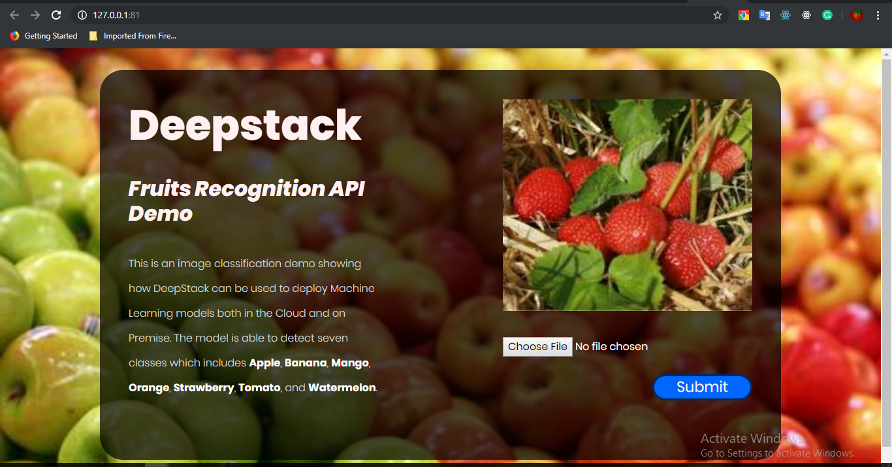
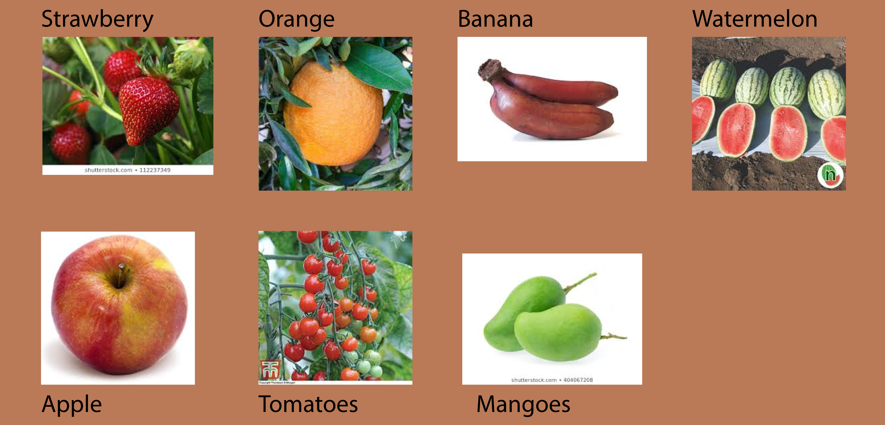
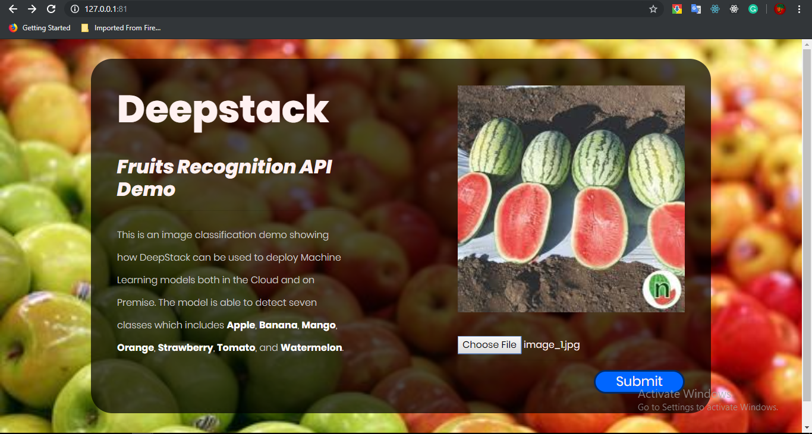
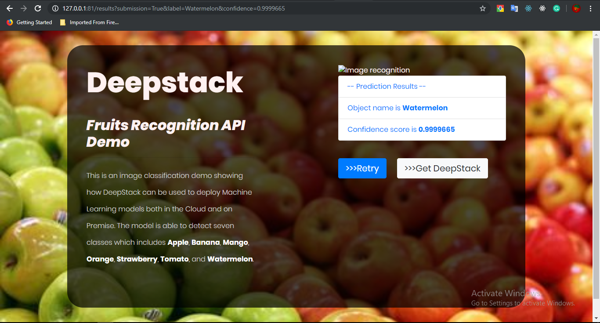

# FruitsRecognitionApp
___
> <strong>A Flask Web App for recognizing fruits, using DeepStack Custom Model APIs</strong> <br>
 <br>
### Classes of Fruits detected
___
There are 7 classes of food detected by the FruitsRecognitionApp.
* Apple
* Mango
* Orange
* Banana
* Straberry
* Tomato
* Watermelon <br>
 <br> 
The dataset was gather via google search and the link of some are provided below
[1](https://www.google.com/search?q=apple+fruit&source=lnms&tbm=isch&sa=X&ved=0ahUKEwiRr5Dyu4LjAhUypnEKHRd0AAYQ_AUIECgB&biw=681&bih=655),[2](https://www.google.com/search?biw=681&bih=655&tbm=isch&sa=1&ei=0PAQXf24E5yAjLsPtOyCsA0&q=red+apple+fruits&oq=red+apple+fruits&gs_l=img.3..0i8i30.27620.31345..31639...0.0..0.231.2718.0j15j1......0....1..gws-wiz-img.......35i39j0i67j0j0i30j0i24.6UjswYHmzVI),[3](https://www.google.com/search?biw=681&bih=655&tbm=isch&sa=1&ei=8fAQXcn8I-zKgwfXypOYDQ&q=green+apple+fruits&oq=green+apple+fruits&gs_l=img.3..0.17337.19431..19911...0.0..0.326.978.0j4j0j1......0....1..gws-wiz-img.......0i7i30.dhmuqp_WWL0),[4](https://www.google.com/search?biw=681&bih=655&tbm=isch&sa=1&ei=B_EQXd42qcmDB5Pvg-AB&q=yellow+apple+fruits&oq=yellow+apple+fruits&gs_l=img.3...40634.42605..42821...0.0..0.200.1028.0j5j1......0....1..gws-wiz-img.VYvl9UvTUZo),[5](https://www.google.com/search?biw=681&bih=655&tbm=isch&sa=1&ei=M_EQXY7-NeGFjLsP9omdkA4&q=orange&oq=orange&gs_l=img.3..35i39l2j0i67l8.14706.15919..16308...0.0..0.225.1083.0j5j1......0....1..gws-wiz-img.......0.2Yj3Mc_jdcc),[6](https://www.google.com/search?biw=681&bih=655&tbm=isch&sa=1&ei=RfEQXeKoKMTlgwfB9LGABQ&q=orange+fruit&oq=orange+fruit&gs_l=img.3..0l10.16403.20282..20598...1.0..0.170.1113.0j7......0....1..gws-wiz-img.......35i39j0i67j0i30.NaNVutTKZuA),[7](https://www.google.com/search?biw=681&bih=655&tbm=isch&sa=1&ei=W_EQXaCcItGHjLsP7-yqkAQ&q=green+orange+fruit&oq=green+orange+fruit&gs_l=img.3..0j0i7i30j0i8i30l7j0i24.20061.21208..21606...0.0..0.167.941.0j6......0....1..gws-wiz-img.......0i8i7i30.YIoTdhpgm-c),[8](https://www.google.com/search?biw=681&bih=655&tbm=isch&sa=1&ei=cvEQXdusJOKfjLsPrc29qA0&q=blood+orange+fruit&oq=blood+orange+fruit&gs_l=img.3..0j0i30j0i24l8.18490.19206..19716...0.0..1.364.1011.0j4j0j1......0....1..gws-wiz-img.......0i7i30.B_im1evTKxM),[9](https://www.google.com/search?biw=681&bih=655&tbm=isch&sa=1&ei=h_EQXfT6MZHAgwefm4eYDg&q=tangerine&oq=tangerine&gs_l=img.3..0j0i67l3j0j0i67j0l4.20981.23248..23785...0.0..0.180.1500.0j9......0....1..gws-wiz-img.......35i39.Lc6hz8OoaCs),[10](https://www.google.com/search?biw=681&bih=655&tbm=isch&sa=1&ei=ofEQXe-pI6LKgwf7uL7ICw&q=orange+basket&oq=orange+basket&gs_l=img.3..0l10.13374.16113..17287...0.0..0.192.2150.0j13......0....1..gws-wiz-img.......35i39j0i67.4SJ3OD_bfqQ),[11](https://www.google.com/search?biw=681&bih=655&tbm=isch&sa=1&ei=tPEQXdPzC7K7gweplqWoCg&q=banana&oq=banana&gs_l=img.3..0i67l4j0l2j0i67l3j0.18847.20420..20868...0.0..0.196.1024.0j6......0....1..gws-wiz-img.......35i39.z4WXhUwzzIQ),[12](https://www.google.com/search?biw=681&bih=655&tbm=isch&sa=1&ei=yvEQXZD-IqmHjLsPl7ieqAU&q=plantain&oq=plantain&gs_l=img.3..0i67l3j0l7.26340.28314..28663...0.0..0.203.1398.0j7j1......0....1..gws-wiz-img.......35i39.tTfpc7bA8oQ),[13](https://www.google.com/search?biw=681&bih=655&tbm=isch&sa=1&ei=6PEQXZnqH4T0U625p8AP&q=green+banana&oq=green+banana&gs_l=img.3..0l10.15008.17677..18363...0.0..1.350.2293.0j9j2j1......0....1..gws-wiz-img.......35i39j0i67.02PryBYUFTs),[14](https://www.google.com/search?biw=681&bih=655&tbm=isch&sa=1&ei=_PEQXZeME86qgwfo4pHgCg&q=small+banana&oq=small+banana&gs_l=img.3..0l10.36005.37419..37917...0.0..0.259.919.0j4j1......0....1..gws-wiz-img.......0i7i30.DxgRsoYg3KU),[15](https://www.google.com/search?biw=681&bih=655&tbm=isch&sa=1&ei=I_IQXeWFKfPhgwf7jIGoBg&q=red+banana&oq=red+banana&gs_l=img.3..0i67l2j0l8.94828.96906..97601...0.0..0.203.844.0j4j1......0....1..gws-wiz-img.......35i39j0i7i30j0i10.AlhQrACtEV4),[16](https://www.google.com/search?biw=681&bih=655&tbm=isch&sa=1&ei=hvIQXZ6pOeWIjLsPlZG_sAk&q=banana+basket&oq=banana+bask&gs_l=img.3.0.0j0i8i30l9.70695.73827..76583...0.0..0.209.1078.0j5j1......0....1..gws-wiz-img.......35i39j0i67j0i5i30.uvWQOfRD9xY),[17](https://www.google.com/search?biw=681&bih=655&tbm=isch&sa=1&ei=1PIQXY-BO4iEjLsP-MWl0Ao&q=mango&oq=mango&gs_l=img.3..0i67l4j0j0i67l5.29489.31931..32506...0.0..0.187.896.0j5......0....1..gws-wiz-img.......35i39.DAwi5uVpwlI),[18](https://www.google.com/search?biw=681&bih=655&tbm=isch&sa=1&ei=9vIQXebtL7ScjLsPk7yUgAo&q=mango+fruit&oq=mango+fruit&gs_l=img.3..0l10.21079.22829..23714...0.0..0.247.1067.0j5j1......0....1..gws-wiz-img.......0i67.hyT897o7tz4),[19](https://www.google.com/search?biw=681&bih=655&tbm=isch&sa=1&ei=D_MQXa_9J4emUJbVgKAG&q=green+mango&oq=green+mango&gs_l=img.3..0j0i67l5j0l2j0i67j0.62275.66919..67581...0.0..0.236.1240.0j6j1......0....1..gws-wiz-img.......35i39j0i7i30j0i10.RkIe__IQoTU),[20](https://www.google.com/search?biw=681&bih=655&tbm=isch&sa=1&ei=VPMQXcCbFMvMgweYk5igBw&q=mango+tree&oq=mango+tree&gs_l=img.3..0l10.19854.23585..34429...0.0..0.442.2228.0j7j1j1j1......0....1..gws-wiz-img.......35i39j0i67.zIC8BZqmYRQ),[21](https://www.google.com/search?biw=681&bih=655&tbm=isch&sa=1&ei=ePMQXb_4C4eJjLsP2Iy_qAk&q=mango+basket&oq=mango+basket&gs_l=img.3..0l6j0i8i30l4.25247.27420..28042...0.0..0.216.1340.0j7j1......0....1..gws-wiz-img.......35i39.HCe24mNFmn8),[22](https://www.google.com/search?biw=681&bih=655&tbm=isch&sa=1&ei=lvMQXYuZApGxUoLVtOgJ&q=palmer+mango&oq=palmer+mango&gs_l=img.3..0l2j0i8i30l2j0i24l3.19362.24448..24914...0.0..0.201.1483.0j8j1......0....1..gws-wiz-img.......35i39j0i67j0i7i30j0i8i7i30.M_H45dyS6-Y),[23](https://www.google.com/search?biw=681&bih=655&tbm=isch&sa=1&ei=sPMQXeTrEbG7gweO4a6ICg&q=tomatoes&oq=tomatoes&gs_l=img.3..0l10.138043.139952..140728...0.0..0.243.1393.0j7j1......0....1..gws-wiz-img.......35i39j0i67.7drP5IWdnJ4),[24](https://www.google.com/search?biw=681&bih=655&tbm=isch&sa=1&ei=PvQQXdLFPIzUUd7Sl9gL&q=green+tomatoes&oq=green+tomatoes&gs_l=img.3..0l7j0i7i30l3.22289.23271..23963...0.0..0.182.1001.0j6......0....1..gws-wiz-img.RQZplJ8AlSU),[25](https://www.google.com/search?biw=681&bih=655&tbm=isch&sa=1&ei=WPQQXfiABsqqgweC_KyACg&q=yellow+tomatoes&oq=yellow+tomatoes&gs_l=img.3..0l4j0i7i30l6.18035.19815..20292...0.0..0.195.993.0j6......0....1..gws-wiz-img.IQaQlFd-awc),[26](https://www.google.com/search?biw=681&bih=655&tbm=isch&sa=1&ei=bfQQXfPjLIuIjLsPm4qn-Ac&q=tomatoes+in+basket&oq=tomatoes+in+basket&gs_l=img.3..0j0i8i30.101429.113498..113974...0.0..0.184.1814.0j11......0....1..gws-wiz-img.......35i39j0i67j0i5i30j0i24.EuJbuMr26tk),[27](https://www.google.com/search?biw=681&bih=655&tbm=isch&sa=1&ei=4fQQXczBM_CzgwfdtpOYAg&q=tomatoes+fruits&oq=tomatoes+fruits&gs_l=img.3..0j0i5i30j0i24.16914.18125..18510...0.0..0.182.963.0j6......0....1..gws-wiz-img.......0i8i30.ePwnSWE21ts),[28](https://www.google.com/search?biw=681&bih=655&tbm=isch&sa=1&ei=9fQQXau2MNqDjLsPiKyU0AY&q=tomatoes+plant&oq=tomatoes+plant&gs_l=img.3..0l10.38119.39568..39880...0.0..0.215.1091.0j5j1......0....1..gws-wiz-img.......35i39.48JCH0U4_HY),[29](https://www.google.com/search?biw=681&bih=655&tbm=isch&sa=1&ei=HvUQXYHvOuWjgwebkraIAg&q=watemelon&oq=watemelon&gs_l=img.3..0j0i10i24l9.168821.174486..174879...1.0..0.189.1712.0j10......0....1..gws-wiz-img.......35i39j0i67j0i10.iK-VSmJncCg),[30](https://www.google.com/search?biw=681&bih=655&tbm=isch&sa=1&ei=z_UQXa_ZJYzagweckZe4Cw&q=watemelon+fruits&oq=watemelon+fruits&gs_l=img.3...12625.14463..15152...0.0..0.295.1412.0j5j2......0....1..gws-wiz-img.......0i10i24.aMfC80vcd3Y),[31](https://www.google.com/search?biw=681&bih=655&tbm=isch&sa=1&ei=AvYQXazILemtgwfttY7YBg&q=water+melon+basket&oq=water+melon+basket&gs_l=img.3..0.1497.1497..1774...0.0..0.155.155.0j1......0....1..gws-wiz-img.2laFtoTyAzE),[32](https://www.google.com/search?biw=681&bih=655&tbm=isch&sa=1&ei=BfYQXan5L6G1gwfZ1JKIBg&q=yellow+water+melon&oq=yellow+water+melon&gs_l=img.3..0i10l10.25335.30646..30978...0.0..0.252.3238.0j16j2......0....1..gws-wiz-img.......35i39j0j0i67j0i10i67.W2u6gRD-8ro),[33](https://www.google.com/search?biw=681&bih=655&tbm=isch&sa=1&ei=JfYQXeaSNoagUN70nsgL&q=water+melon+plant&oq=water+melon+plant&gs_l=img.3..0l8j0i10i24j0i24.17465.22024..22269...1.0..0.189.2978.0j18......0....1..gws-wiz-img.......35i39j0i10i67j0i67j0i10.PMAwPVOxt_4),[34](https://www.google.com/search?biw=681&bih=655&tbm=isch&sa=1&ei=PfYQXeWjJo2bjLsP0YqfiAo&q=Charleston+Watermelon&oq=Charleston+Watermelon&gs_l=img.3..0j0i8i30l2.18710.18710..19632...0.0..0.178.178.0j1......0....2j1..gws-wiz-img.ly9XFVFjbJc),[35](https://www.google.com/search?biw=681&bih=655&tbm=isch&sa=1&ei=UvYQXcC3L4n0U-CDiZAO&q=strawberry&oq=strawberry&gs_l=img.3..0i67l3j0l7.14862.18413..18912...0.0..0.179.1703.0j10......0....1..gws-wiz-img.......35i39.VzPyWUReZGY),[36](https://www.google.com/search?biw=681&bih=655&tbm=isch&sa=1&ei=Z_YQXf-IAaiLjLsPhoSToAk&q=strawberry+fruits&oq=strawberry+fruits&gs_l=img.3..0l3j0i8i30l5j0i24l2.13337.15366..15688...0.0..0.271.1283.0j6j1......0....1..gws-wiz-img.......0i67.gwcm651jovk),[37](https://www.google.com/search?biw=681&bih=655&tbm=isch&sa=1&ei=d_YQXbXfN7PJgwfF3pXIBA&q=unripe+strawberry&oq=unripe+strawberry&gs_l=img.3..0j0i5i30j0i24.14161.19426..19955...0.0..0.229.1530.0j5j3......0....1..gws-wiz-img.......35i39j0i67j0i7i30.B-OvQGLMIKo),[38](https://www.google.com/search?biw=681&bih=655&tbm=isch&sa=1&ei=jfYQXcTaFe6KjLsP8b6ksAQ&q=strawberry+plant&oq=strawberry+plant&gs_l=img.3..0l10.19087.22191..22674...0.0..0.205.1322.0j5j2......0....1..gws-wiz-img.......35i39j0i67.d9xfj_Dw2K8),[39](https://www.google.com/search?biw=681&bih=655&tbm=isch&sa=1&ei=pfYQXcb8Eoq2Uv3IgMgL&q=strawberry+basket&oq=strawberry+basket&gs_l=img.3..0l7j0i5i30l3.19710.21843..22127...0.0..0.174.1335.0j8......0....1..gws-wiz-img.......35i39.EtO4mOB4JDA)
### Deep learning architecture
___
> The deep learing model used in this FruitsRecognitionApp was built on a deep neural network architecture know as ResNet(Residual Neural Networks). Residual neural networks are a special kind of deep neural network architecture that makes use of residual units. Residual unit is made by joining two or three convolution neural networks together and adding the input of the previous convolutional network to the out the next convolutional network. These residual units help to solve the most difficult problems with deep neural networks know as varnishing gradients. Residual neural networks also have there challenges like diminishing feature reuse, but they have to prove to work really well when building a deep learning model. Hence they are used in this project
### How FruitsRecognitionApp works
___
> This web app is built on bootstrap, flask and jinja. The web app take the image to be classified send it to the custom model endpoint on DeepStack AI server an resturn a JSON. This JSON value contains the the true label for the image, and the model confidence score which is then displayed by the web app. <br> <em>The model used used for this predictions was built with pytorch as exported to onnx with the code bellow:<em>

```
load_saved_model = torch.load('<model_name>.pt')
dummy_input = torch.FloatTensor(1,3,<int:img_width>,<int:img_height>)
dummy_input = dummy_input.to(device)
torch.onnx.export(load_saved_model, dummy_input, '<onnx_name>.onnx')
```

>The model was deployed to deepstack using the code below:

```
#config.json file
{"sys-version": "1.0",
    "framework":"ONNX",
    "mean":0.5,
    "std":255,
    "width":224,
    "height":224,
    "map": {
        "0" : "Apple",
        "2" : "Mango",
        "3" : "Orange",
        "1" : "Banana",
        "4" : "Strawberry",
        "5" : "Tomato",
        "6" : "Watermelon"
    }}
    
#deeploying_to_deepstack.py
import requests
from io import  open

model = open("FruitsDetect.onnx","rb").read()
config = open("config.json","rb").read()

response = requests.post("http://localhost:80/v1/vision/addmodel",
            files={"model":model,"config":config},data={"name":"FruitsDetect"}).json()
```
> Images of an uploaded image and the displayed results



### Frameworks used
___
> #### Pytorch:
PyTorch is software, specifically a machine learning library for the programming language Python, based on the Torch library, used for applications such as deep learning and natural language processing. It is primarily developed by Facebook's artificial-intelligence research group, and Uber's Pyro probabilistic programming language software is built on it. It is free and open-source software released under one of the BSD licenses.<br>[https://pytorch.org/](https://pytorch.org/)

> #### TorchFusion: 
A modern deep learning framework built on pytorch to accelerate research and development of AI systems.
```
pip3 install torchfusion_utils
```
> #### Numpy:
NumPy is a library for the Python programming language, adding support for large, multi-dimensional arrays and matrices, along with a large collection of high-level mathematical functions to operate on these arrays.
```
pip3 install numpy
```
> #### Mathplotlib:
Matplotlib is a plotting library for the Python programming language and its numerical mathematics extension NumPy. It provides an object-oriented API for embedding plots into applications using general-purpose GUI toolkits like Tkinter, wxPython, Qt, or GTK+. 
```
pip3 install matplotlib
```
> ### Flask
Flask is a micro web framework written in Python. It is classified as a microframework because it does not require particular tools or libraries. It has no database abstraction layer, form validation, or any other components where pre-existing third-party libraries provide common functions.
```
pip3 install flask
```
> ### Bootstrap
Bootstrap is an open source toolkit for developing with HTML, CSS, and JS. Quickly prototype your ideas or build your entire app with our Sass variables and mixins, responsive grid system, extensive prebuilt components, and powerful plugins built on jQuery. <br> [bootstrap](https://getbootstrap.com/docs/4.3/getting-started/download/)

### Installing DeepStack
___
>[Windows](https://deepstack.cc/install/windows) <br>
[Linux](https://deepstack.cc/install/linux)


```python

```
